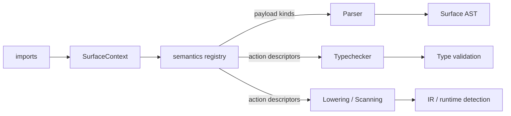

# Incan Compiler Architecture

This document describes the internal architecture of the Incan compiler.

## Compilation Pipeline

This diagram shows the compilation pipeline of the Incan compiler in high level.

```bash
┌─────────────────────────────────────────────────────────────────────────────┐
│                                FRONTEND                                     │
├─────────────────────────────────────────────────────────────────────────────┤
│                                                                             │
│     .incn source ──► Lexer ──► Parser ──► TypeChecker ──► AST (typed)       │
│                                                                             │
└────────────────────────────────────┬────────────────────────────────────────┘
                                     │
                                     ▼
┌─────────────────────────────────────────────────────────────────────────────┐
│                                 BACKEND                                     │
├─────────────────────────────────────────────────────────────────────────────┤
│                                                                             │
│   AST ──► AstLowering ──► IR ──► IrEmitter ──► TokenStream ──► Rust source  │
│                                     ▲                                       │
│                                     └──► prettyplease (formatting)          │
│                                                                             │
└────────────────────────────────────┬────────────────────────────────────────┘
                                     │
                                     ▼
┌─────────────────────────────────────────────────────────────────────────────┐
│                           PROJECT GENERATION                                │
├─────────────────────────────────────────────────────────────────────────────┤
│                                                                             │
│       ProjectGenerator ──► Cargo.toml + src/*.rs ──► cargo build/run        │
│                                                                             │
└─────────────────────────────────────────────────────────────────────────────┘
```

### Glossary

<!-- markdownlint-disable MD013 MD060 -->

|       Term       |                                                                     Meaning                                                                      |
| ---------------- | ------------------------------------------------------------------------------------------------------------------------------------------------ |
| Frontend         | Parses `.incn` and typechecks it, producing a typed AST (or diagnostics).                                                                        |
| `.incn` source   | The source code of an Incan program.                                                                                                             |
| Lexer            | Tokenizes source text into tokens (used by the parser). It converts source code into a token stream the parser can understand.                   |
| Parser           | Parses lexer tokens into an AST.                                                                                                                 |
| AST              | The abstract syntax tree (syntax structure + spans for diagnostics).                                                                             |
| Soft keyword     | A keyword that is only reserved after importing a particular stdlib namespace (e.g. `async` / `await` after importing `std.async`).              |
| Typechecker      | Resolves names/imports and checks types, annotating the AST with type information.                                                               |
| Typed AST        | AST after typechecking, with resolved types attached to relevant nodes.                                                                          |
| Backend          | Generates Rust code from the typed AST.                                                                                                          |
| Lowering         | Transforms typed AST → IR (including ownership/mutability/conversion decisions).                                                                 |
| IR               | A Rust-oriented, ownership-aware intermediate representation used for code generation.                                                           |
| IrEmitter        | Emits IR into a Rust `TokenStream` before final formatting.                                                                                      |
| TokenStream      | Rust `TokenStream` from codegen (`proc_macro2` via `quote`/`syn`). This is the final output of the compiler before being formatted to Rust code. |
| prettyplease     | Formats Rust syntax/TokenStream into human-readable Rust source code.                                                                            |
| Rust source      | The generated Rust code as text.                                                                                                                 |
| ProjectGenerator | Writes the generated Rust code into a standalone Cargo project (and can invoke `cargo build/run`).                                               |
| Cargo project    | Generated Rust project directory (`Cargo.toml`, `src/*`, and build artifacts).                                                                   |
| Cargo            | Rust’s build system and package manager.                                                                                                         |
| CLI              | Command-line entrypoint for compile/build/run/fmt/test workflows.                                                                                |
| LSP              | IDE server running frontend stages; returns diagnostics/hover/definition via the Language Server Protocol.                                       |
| Runtime crates   | `incan_stdlib` / `incan_derive` crates used by generated programs (not the compiler).                                                            |

<!-- markdownlint-enable MD013 MD060 -->

## Walkthrough: `incan build`

This section describes what happens internally when you run `incan build path/to/main.incn`.

```bash
incan build file.incn
  │
  ├──▶ 1) Collect modules (imports)
  │       - Parse the entry file and any imported local modules
  │       - Produces: a list of parsed modules (source + AST) in dependency order
  │
  ├──▶ 2) Type check (with imports)
  │       - Name resolution + type checking across the module set
  │       - Produces: a typed AST (or structured diagnostics)
  │
  ├──▶ 3) Backend preparation
  │       - Scan for feature usage (e.g. serde / async / web / helpers)
  │       - Collect `rust::` crate imports for Cargo dependency injection
  │
  ├──▶ 4) Code generation
  │       - Lower typed AST → ownership-aware IR
  │       - Emit IR → Rust TokenStream → formatted Rust source
  │       - If imports are present: generate a nested Rust module tree
  │
  ├──▶ 5) Project generation
  │       - Write a standalone Cargo project (Cargo.toml + src/*.rs)
  │       - Default output dir: target/incan/<project_name>/
  │
  └──▶ 6) Build
          - `cargo build --release`
          - Binary path: target/incan/<project_name>/target/release/<project_name>
```

Notes:

- **Debugging individual stages**: Use CLI stage flags (`--lex`, `--parse`, `--check`, `--emit-rust`) to inspect
  intermediate outputs (see [Getting Started](../../tooling/tutorials/getting_started.md)).
- **Multi-file projects**: Import resolution rules and module layout are described in [Imports & Modules](../../language/explanation/imports_and_modules.md).
- **Rust interop dependencies**: `rust::` imports trigger Cargo dependency injection with a strict policy
  (see [Rust Interop](../../language/how-to/rust_interop.md) and [RFC 013]).
- **Runtime boundary**: Generated programs depend on `incan_stdlib` and `incan_derive`, but the compiler does not (see `crates/`).

## Module Layout

```bash
Frontend (turns source text into a typed AST)
  ├──▶ Lexing + parsing
  │     - Converts `.incn` text into an AST
  │     - Attaches spans for precise diagnostics
  ├──▶ Name resolution + type checking
  │     - Builds symbol tables, resolves imports
  │     - Produces a typed AST (or structured errors)
  └──▶ Diagnostics (shared)
        - Pretty, source-context errors used by CLI / Formatter / LSP

Backend (turns typed AST into Rust code)
  ├──▶ Feature scanning
  │     - Detects language features used (serde/async/web/this/etc.)
  │     - Collects required Rust crates / routes / runtime needs
  ├──▶ IR + lowering
  │     - Lowers typed AST to a Rust-oriented, ownership-aware IR
  │     - Central place for ownership/mutability/conversion decisions
  └──▶ Emission + formatting
        - Emits Rust (TokenStream → formatted Rust source)
        - Applies consistent interop rules (borrows/clones/String conversions)

Project generation (turns Rust code into a runnable Cargo project)
  ├──▶ Planning (pure)
  │     - Compute dirs/files + chosen cargo action (build/run)
  ├──▶ Execution (side effects)
  │     - Writes files, creates dirs, shells out to cargo
  └──▶ Dependency policy
        - Controlled mapping for `rust::` imports (no silent wildcard deps)

CLI (user-facing orchestration)
  ├──▶ Compile actions
  │     - build/run: Frontend → Backend → Project generation → cargo
  ├──▶ Developer actions
  │     - lex/parse/check/emit-rust: inspect intermediate stages
  └──▶ Tool actions
        - fmt: format valid syntax
        - test: discover/run tests (pytest-style)

LSP (IDE-facing orchestration)
  ├──▶ Language server
  │     - Runs Frontend (and selected tooling) on edits
  └──▶ Protocol adapters
        - Converts compiler diagnostics into LSP diagnostics (and more over time)

Runtime crates (used by generated Rust programs, not the compiler)
  ├──▶ incan_stdlib
  │      - Traits + helpers (prelude, reflection, JSON helpers, etc.)
  │      - `incan_stdlib::r#async`: `std.async` runtime facade backed by Tokio re-exports
  └──▶ incan_derive
        - Proc-macro derives to generate impls for stdlib traits
```

## Semantic Core

Incan has a **semantic core** crate (`incan_core`) that holds pure, deterministic helpers shared by the compiler and
runtime, without creating dependency cycles.

- **Location**: `crates/incan_core`
- **Purpose**: centralize semantic policy and pure helpers so compile-time behavior and runtime behavior cannot drift.
- **Used by**: compiler (typechecker, const-eval, lowering/codegen decisions) and stdlib/runtime helpers.
- **Constraints**: pure/deterministic (no IO, no global state) and no dependencies on compiler crates.
- **Stdlib registry**: `incan_core::lang::stdlib::STDLIB_NAMESPACES` drives stdlib import validation, stub path resolution,
  unknown-module hints, and import-activated language features (soft keywords like `async`/`await`).

See crate-level documentation in `crates/incan_core` for the contract, extension checklist,
and drift-prevention expectations; tests in `tests/semantic_core_*` serve as the source of truth
for covered domains.

## Syntax Frontend

Incan has a shared **syntax frontend** crate (`incan_syntax`) that centralizes lexer/parser/AST/diagnostics in a
dependency-light crate suitable for reuse across compiler and tooling.

- **Location**: `crates/incan_syntax`
- **Purpose**: provide a single, shared syntax layer (lexing, parsing, AST, diagnostics) to prevent drift between
  compiler, formatter, LSP, and future interactive tooling.
- **Used by**: compiler frontend and tooling (formatter/LSP); depends on `incan_core::lang` registries for vocabulary ids.
- **Constraints**: syntax-only (no name resolution/type checking/IR); no dependencies on compiler crates.

### Frontend (`src/frontend/`)

|         Module         |                                       Purpose                                       |
| ---------------------- | ----------------------------------------------------------------------------------- |
| `lexer`                | Tokenization (re-exported from `crates/incan_syntax`)                               |
| `parser`               | Parser (re-exported from `crates/incan_syntax`)                                     |
| `ast`                  | Untyped AST (`Spanned<T>` for diagnostics) (re-exported from `crates/incan_syntax`) |
| `module.rs`            | Import path modeling and module metadata                                            |
| `resolver.rs`          | Multi-file module resolution                                                        |
| `surface_semantics.rs` | Import-driven activation + feature-key routing for soft keywords/decorators         |
| `typechecker/`         | Two-pass collection + type checking                                                 |
| `symbols.rs`           | Symbol table and scope management                                                   |
| `diagnostics`          | Syntax/parse diagnostics (re-exported from `crates/incan_syntax`)                   |

#### Typechecker submodules (`typechecker/`)

|            File             |                    Responsibility                     |
| --------------------------- | ----------------------------------------------------- |
| `mod.rs`                    | `TypeChecker` API (`check_program`, imports)          |
| `collect.rs`                | Pass 1: register types/functions/imports              |
| `collect/stdlib_imports.rs` | Stdlib namespace validation + soft keyword activation |
| `check_decl.rs`             | Pass 2: validate declarations                         |
| `check_stmt.rs`             | Statement checking (assign/return/control)            |
| `check_expr/`               | Expression checking (calls/indexing/ops/match)        |

## Surface Semantics Engine

Surface syntax features (soft keywords, decorator semantics) are fully driven by a **semantics registry**. Every
compiler stage — parser, typechecker, lowering, and scanning — consults the registry instead of hardcoding keyword
identities. The design separates *feature knowledge* (which keyword does what) from *execution knowledge* (how the
compiler performs each action):



### Action descriptors

Packs don't execute compiler logic directly (that would create circular dependencies). Instead, they return small
**action descriptor** enums that tell the compiler *what to do*:

<!-- markdownlint-disable MD013 -->

|            Enum             |   Variants (current)   |   Used by   |                     Purpose                     |
| --------------------------- | ---------------------- | ----------- | ----------------------------------------------- |
| `SurfaceStmtLoweringAction` | `AssertCall`           | Lowering    | Describes how to lower a surface statement      |
| `SurfaceExprLoweringAction` | `Await`                | Lowering    | Describes how to lower a surface expression     |
| `SurfaceStmtTypeCheck`      | `AssertCheck`          | Typechecker | Describes how to typecheck a surface statement  |
| `SurfaceExprTypeCheck`      | `AwaitCheck`           | Typechecker | Describes how to typecheck a surface expression |
| `RuntimeRequirement`        | `None`, `AsyncRuntime` | Scanning    | Runtime implied by a modifier or import         |

<!-- markdownlint-enable MD013 -->

Multiple keywords can share the same action descriptor (e.g., a hypothetical `ensure` keyword could reuse
`AssertCall`). Adding a keyword that fits an existing action pattern is a **pack-only change** — zero touches to the
main compiler crate.

### Core pieces

- `crates/incan_semantics_core`
    - Defines stable `SurfaceFeatureKey` ids and payload categories used by parser/typechecker/lowering.
    - Defines the action descriptor enums listed above.
    - Defines `SurfaceSemanticsPack` trait (full compiler-stage coverage) and `SurfaceSemanticsRegistry`.
- `crates/incan_semantics_stdlib`
    - Implements stdlib semantics pack(s) for `assert`, `async`, `await`, and stdlib decorator families.
    - Returns action descriptors for each compiler stage, gated by Cargo features (`std_testing`, `std_async`).
    - Exposes canonical call targets (e.g., `std.testing.assert_*`) and runtime requirements.
- `src/frontend/surface_semantics.rs`
    - Builds `SurfaceContext` from imports and aliases.
    - Provides import-driven soft-keyword activation and registry queries.
- `src/frontend/typechecker/check_stmt.rs` / `check_expr/mod.rs`
    - `check_surface_stmt()` and `check_surface_expr()` query the registry for typecheck action descriptors and
      dispatch on the returned action — no `KeywordId` matching.
- `src/backend/ir/lower/stmt.rs` / `lower/expr/mod.rs`
    - `lower_surface_statement()` and the `Expr::Surface` arm of `lower_expr()` query the registry for lowering
      action descriptors and dispatch on the returned action — no `KeywordId` matching.
- `src/backend/ir/scanners/async_.rs`
    - Detects async runtime requirement by asking the registry about each import and each surface modifier —
      no hardcoded module names or keyword checks.
- `src/backend/ir/surface_semantics.rs`
    - Thin helpers for action execution (assert condition decomposition, await IR wrapping).
- `src/backend/ir/expr.rs` (`IrExprKind::Call`)
    - Carries optional canonical callee path metadata.
    - Lets emission resolve stdlib calls independent of local import style.

### Feature gating

Feature gating is compile-time and crate-level:

- `std_testing`, `std_async`, and `std_decorators` enable pack capabilities through Cargo features.
- When disabled, the corresponding semantics handlers are not compiled into the `incan` artifact.

### Adding a new soft keyword or decorator

If the new keyword fits an existing action pattern, only steps 1–3 require code changes:

1. Add activation metadata in `incan_core::lang` registry tables (`KeywordId` + `info_soft()`).
2. Implement the relevant `SurfaceSemanticsPack` methods in `incan_semantics_stdlib` (or another pack crate):
   parser routing, typecheck action, lowering action, runtime requirements, and call targets as needed.
3. Ensure parser emits generic surface payload with `SurfaceFeatureKey` handoff (usually automatic via existing
   parser helpers).
4. **Typechecker / Lowering / Scanning**: no changes needed — the registry returns the action descriptor and the
   existing dispatch handles it.
5. Handle the new surface node in the **formatter** (usually a one-liner).
6. Add parser/typechecker/codegen tests and update snapshots.

If the keyword needs a *new* compiler behavior pattern, add a variant to the relevant action descriptor enum in
`incan_semantics_core` and a handler arm in the corresponding compiler module. This is deliberately rare — action
descriptors represent compiler behavior patterns, not individual keywords.

### Backend (`src/backend/`)

|       Module        |                     Purpose                     |
| ------------------- | ----------------------------------------------- |
| `ir/codegen.rs`     | Entry point (`IrCodegen`): lowering + emission  |
| `ir/lower/`         | AST → IR lowering (types + ownership decisions) |
| `ir/emit/`          | IR → Rust via `syn`/`quote`                     |
| `ir/emit_service/`  | Emission helpers split by layer                 |
| `ir/conversions.rs` | Centralized conversions (`&str` → `String`)     |
| `ir/types.rs`       | IR types (`IrType`)                             |
| `ir/expr.rs`        | IR expressions (`TypedExpr`, builtins, methods) |
| `ir/stmt.rs`        | IR statements (`IrStmt`)                        |
| `ir/decl.rs`        | IR declarations (`IrDecl`)                      |
| `project.rs`        | Cargo project scaffolding and generation        |

#### Expression Emission (`src/backend/ir/emit/expressions/`)

The expression emitter is split into focused submodules for maintainability:

|      Submodule      |                     Purpose                      |
| ------------------- | ------------------------------------------------ |
| `mod.rs`            | `emit_expr` entry point and dispatch             |
| `builtins.rs`       | Builtin calls (`print`, `len`, `range`, etc.)    |
| `methods.rs`        | Known methods + fallback method calls            |
| `calls.rs`          | Function calls and binary operations             |
| `indexing.rs`       | Index/slice/field access                         |
| `comprehensions.rs` | List and dict comprehensions                     |
| `structs_enums.rs`  | Struct constructors and enum-related expressions |
| `format.rs`         | f-strings and range expressions                  |
| `lvalue.rs`         | Assignment targets                               |

**Enum-based dispatch**: Built-in functions and known methods use enum types (`BuiltinFn`, `MethodKind`)
instead of string matching.
This provides compile-time exhaustiveness checking and makes it easier to add new builtins/methods
(see [Extending Incan](../how-to/extending_language.md)).

### CLI (`src/cli/`)

|      Module      |                  Purpose                  |
| ---------------- | ----------------------------------------- |
| `commands.rs`    | Command handlers (`build`, `run`, `fmt`)  |
| `test_runner.rs` | pytest-style test discovery and execution |
| `prelude.rs`     | Stdlib loading (embedded `.incn` files)   |

### Tooling

|  Module   |                Purpose                |
| --------- | ------------------------------------- |
| `format/` | Source formatter                      |
| `lsp/`    | LSP backend logic (diagnostics/hover) |
| `bin/`    | Extra binaries (e.g. `lsp`)           |

## Key Data Types

```text
AST (frontend)          IR (backend)              Rust (output)
─────────────────       ──────────────────        ─────────────────
ast::Program       ──►  IrProgram            ──►  TokenStream
ast::Declaration   ──►  IrDecl               ──►  (syn Items)
ast::Statement     ──►  IrStmt               ──►  (syn Stmts)
ast::Expr          ──►  TypedExpr            ──►  (syn Expr)
ast::Type          ──►  IrType               ──►  (syn Type)
```

## Ownership & Data Flow

1. **Frontend** parses and typechecks, producing an owned `ast::Program`
2. **Backend** borrows `&ast::Program`, produces owned `IrProgram`
3. **Emitter** borrows `&IrProgram`, produces owned `TokenStream`
4. **prettyplease** formats `TokenStream` to `String`
5. **ProjectGenerator** writes files to disk

## Entry Points

- **CLI**: `src/main.rs` → `cli::run()`
- **Codegen**: `IrCodegen::new()` → `.generate(&ast)`
- **LSP**: `src/bin/lsp.rs`

## Extending the Language

Incan’s compiler is intentionally staged (Lexer → Parser/AST → Typechecker → IR → Rust). This makes the system easier
to reason about, but it also means “language changes” can touch multiple layers.

For contributor guidance on **when to add a builtin vs when to add new syntax**, plus end-to-end checklists, see:

- [Extending Incan: Builtins vs New Syntax](../how-to/extending_language.md)

--8<-- "_snippets/rfcs_refs.md"
