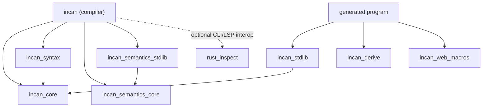

# Layering Rules

This repository follows a strict dependency direction to keep semantics shared and prevent accidental drift between the compiler and the runtime:

- `incan` (compiler) may depend on `incan_core`.
- `incan` may depend on `incan_syntax`, `incan_semantics_core`, `incan_semantics_stdlib`, and optional `rust_inspect` for compiler/toolchain work.
- `incan` must **not** depend on `incan_stdlib` except as a **dev-dependency** for parity tests.
- `incan_stdlib` depends on `incan_core`.
- Generated user programs depend on `incan_stdlib`.

CI/Test guardrails enforce that `incan` keeps `incan_stdlib` out of its normal dependencies. If you need runtime helpers inside tests, add them under `[dev-dependencies]` only.

## Workspace crate categories

Use this policy when deciding where new code belongs:

- **Stable contracts**: `incan_core`, `incan_syntax`, `incan_semantics_core`, and `incan_vocab`. Other layers build on these crates. Keep them deterministic, dependency-light, and free of runtime side effects.
- **Compiler/toolchain implementation**: `incan`, `incan_semantics_stdlib`, and `rust_inspect`. These crates are tied to the current compiler/tooling. They may depend on stable contracts but should not become runtime APIs.
- **Runtime-only implementation**: `incan_stdlib`, `incan_derive`, and `incan_web_macros`. Generated Rust programs use these crates. The compiler may generate references to them but must not depend on them in normal builds.
- **Transitional runtime surfaces**: current `incan_stdlib::web` and related macro glue. This runtime code is not yet a stable long-term contract. Keep it quarantined and avoid treating it as compiler-owned policy.

## Why we do this

We want one “source of truth” for language behavior so the compiler and runtime don’t drift:

- **Semantics must match**: if const-eval validates something, runtime should do the same thing the same way (especially for Unicode-sensitive string operations and numeric edge cases).
- **Diagnostics/panics must stay aligned**: user-facing error messages should not diverge between compile-time and runtime.
- **Compiler stays lean**: the compiler shouldn’t accidentally pull in runtime-only APIs or heavy dependencies.

## What goes where (contracts vs implementations)

**`incan_core`**:

- Pure helpers that define *meaning/policy* (e.g., string indexing/slicing rules, numeric promotion, canonical error message constants).
- Central registries for language vocabulary and stdlib wiring (for example `incan_core::lang::stdlib::STDLIB_NAMESPACES` and keyword metadata used by the lexer/parser).
- Must be deterministic and side-effect free.
- Should not depend on compiler internals (AST, spans, lexer/parser state).
- Should not gain new stdlib-owned runtime surface types unless the type metadata is truly shared language policy.

**`incan_syntax`**:

- Lexer, parser, AST, and syntax diagnostics shared by compiler, formatter, LSP, and future tooling.
- May use language vocabulary from stable contract crates.
- Must not perform name resolution, typechecking, lowering, Rust interop loading, or runtime behavior.

**`incan_semantics_core`**:

- Stable action-descriptor and semantics-pack contracts that compiler stages can consume.
- Owns behavior descriptors, not compiler execution. Packs describe what to do; compiler stages decide how to do it.

**`incan_semantics_stdlib`**:

- Stdlib semantics-pack implementation for current built-in library surfaces.
- Toolchain-locked implementation crate, not a stable external API.
- Should return descriptors and canonical targets instead of reaching into compiler internals.

**`rust_inspect`**:

- Dedicated Rust metadata preparation, extraction, and caching subsystem.
- Allowed behind compiler/tooling features for Rust interop.
- Should remain explicit and staged: prepare/prewarm metadata at CLI/LSP/project boundaries, then read cached metadata in semantic paths.

**`incan_stdlib`**:

- Runtime helpers used by generated Rust code.
- Includes facades that generated code imports (for example `incan_stdlib::r#async` backing the `std.async` namespace).
- Should delegate behavior to `incan_core` for policy/consistency, and implement runtime-only actions (like panicking) using the shared error messages/taxonomy.
- May contain transitional implementation modules, but those modules must not become compiler dependencies.

**`incan_derive` / `incan_web_macros`**:

- Runtime-side macro support for generated Rust programs.
- Must not become a backchannel for compiler logic.
- Web macro/runtime glue is transitional until the web surface has a stable long-term ownership model.

**`incan` (compiler)**:

- Parsing, typing, lowering, codegen, diagnostics.
- May use stable contract crates to implement checks/const-eval and to keep error text aligned.
- Must not use runtime-only crates in normal builds; only `incan_stdlib` as a dev-dependency for parity tests.

## Allowed / forbidden dependencies

**Allowed**:

- `incan` → `incan_core`, `incan_syntax`, `incan_semantics_core`, `incan_semantics_stdlib`, `incan_vocab` as normal compiler/toolchain dependencies.
- `incan` → `rust_inspect` behind the `rust_inspect`/CLI/LSP interop path.
- `incan_stdlib` → `incan_core` as a normal dependency.
- `incan` → `incan_stdlib` as a dev-dependency only, for tests.

**Forbidden**:

- `incan` → `incan_stdlib` in `[dependencies]` (this breaks layering).
- `incan` → `incan_derive` or `incan_web_macros` in normal dependencies.
- `incan_core`, `incan_syntax`, or `incan_semantics_core` → compiler/toolchain/runtime implementation crates.
- Runtime crates calling back into compiler crates.

## Common pitfalls

- Adding a “quick helper” in `incan_stdlib` and calling it from the compiler.
    - Fix: move the policy/logic to `incan_core` and keep only runtime glue (panics, wrappers) in `incan_stdlib`.

- Adding another stdlib-specific surface type to `incan_core` because similar metadata already exists there.
    - Fix: decide whether the type is true language policy or library-owned surface. Prefer library-defined ownership when possible, and document the exception when it must stay core-owned.

- Emitting direct Rust operations that bypass shared semantics (e.g., slicing Rust `String` by byte indices).
    - Fix: emit calls to `incan_stdlib` wrappers which themselves delegate to `incan_core`.

- Duplicating error messages as string literals in multiple places.
    - Fix: put canonical text in `incan_core` and reuse it from both compiler and runtime.

- Loading Rust metadata opportunistically from typechecking or lowering.
    - Fix: prewarm through the explicit `rust_inspect` preparation path and keep semantic lookups cache-oriented.

## Guardrails (how it is enforced)

- **Dependency gate**: `tests/layering_guard.rs` fails if `incan_stdlib` appears in the compiler crate’s
    `[dependencies]` section of the root `Cargo.toml`. (Keeping `incan_stdlib` in `[dev-dependencies]` for parity tests is allowed.)

## How to add shared behavior safely

When you notice drift risk (compiler vs runtime):

1. Put the *policy* in `incan_core` (pure function + typed error or canonical message).
2. Add a thin wrapper in `incan_stdlib` that calls semantics and performs runtime-only behavior (panic, allocation, conversions).
3. Update compiler const-eval / typechecking to use the semantics helper directly (never stdlib).
4. Add a parity test in `tests/` that compares compiler/semantics/runtime behavior for the edge case.
