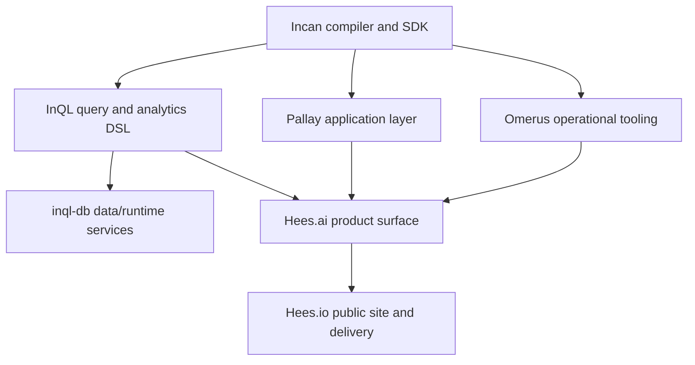

# Encero stack

Incan is the typed compiler substrate for the Encero stack. It is not the whole product story by itself: the goal is a set of domain tools that can use Python-like source ergonomics, Rust-backed execution, explicit metadata, and inspectable build artifacts without every project rebuilding those foundations independently.

Incan owns the language, compiler, package/build tooling, standard library, Rust interop, diagnostics, and inspection surfaces. InQL, Pallay, and Omerus are downstream consumers that prove different kinds of product and data workflows. Hees.ai and Hees.io sit higher in the stack and should be referenced from Incan docs as stack context, not as implementation scope for the Incan compiler release.

For 0.4, the practical takeaway is narrow: a new evaluator should be able to install Incan, create a project, run and test it, inspect diagnostics and generated artifacts, and understand how downstream projects will consume the same compiler surfaces. Building Hees.ai, a package registry, or product-specific SDKs is not part of the Incan 0.4 release.
