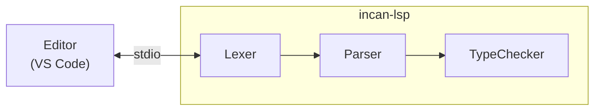

# LSP architecture

This page explains how the Incan Language Server works internally.

## High-level design

The LSP is built with [tower-lsp](https://github.com/ebkalderon/tower-lsp) and reuses Incan's compiler frontend.

On each file change, the LSP runs the compiler pipeline and reports:

- lexer errors (tokenization failures)
- parser errors (syntax errors)
- type errors (type mismatches, unknown symbols, etc.)
- checked public API metadata hover previews when typechecking succeeds
- Contract-backed model emit through `workspace/executeCommand` command `incan.metadata.model.emit`

The LSP keeps checked API metadata in memory for hover. Full checked API metadata package retrieval remains a CLI surface through `incan tools metadata api`. Contract model emit can inspect project bundle metadata, bundle JSON files, or `.incnlib` artifacts through the explicit `incan.metadata.model.emit` command.
